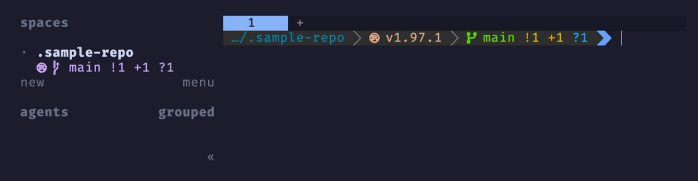
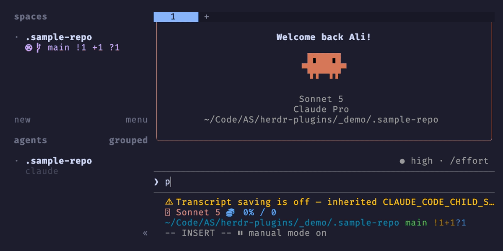

# herdr-plugins

Plugins for [Herdr](https://herdr.dev).

## Plugins

| Plugin | Description |
| --- | --- |
| [starship](starship) | Renders a `starship.toml` file onto a Herdr workspace's sidebar. |
| [yazi-popup](yazi-popup) | Pops [Yazi](https://yazi-rs.github.io/) open over the triggering pane and types picks back as `@path`. |
| [speak-status](speak-status) | Speaks an audible status update (done, waiting) when an agent pane's status changes. |
| [tally](tally) | Stamps sidebar `$num` tokens across workspaces/panes on startup and on demand. |

### starship



### yazi-popup



## Installation

Each plugin lives in its own subdirectory. Install with:

```bash
herdr plugin install alastairsounds/herdr-plugins/starship
herdr plugin install alastairsounds/herdr-plugins/yazi-popup
herdr plugin install alastairsounds/herdr-plugins/speak-status
herdr plugin install alastairsounds/herdr-plugins/tally
```

See each plugin's own README for setup details.
